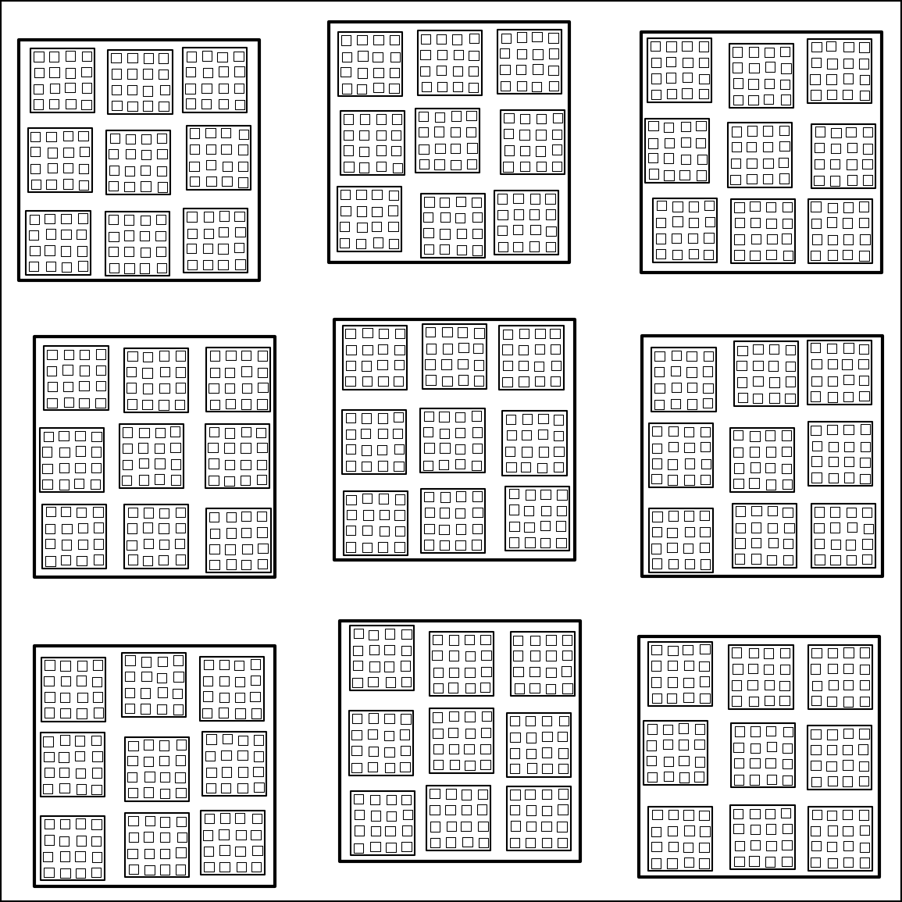
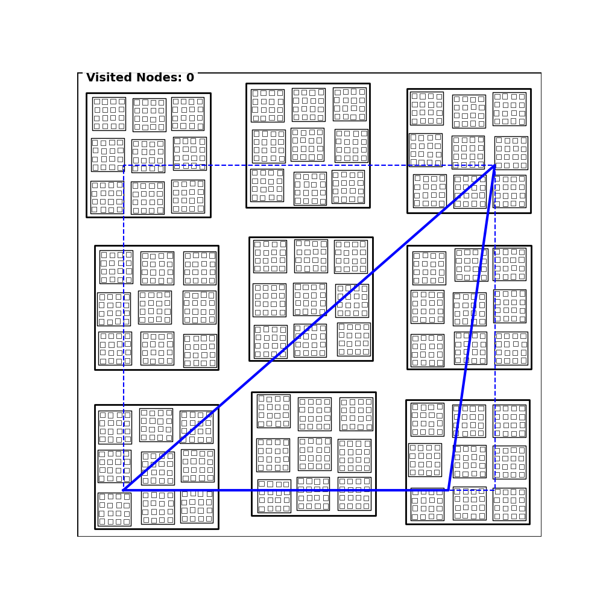
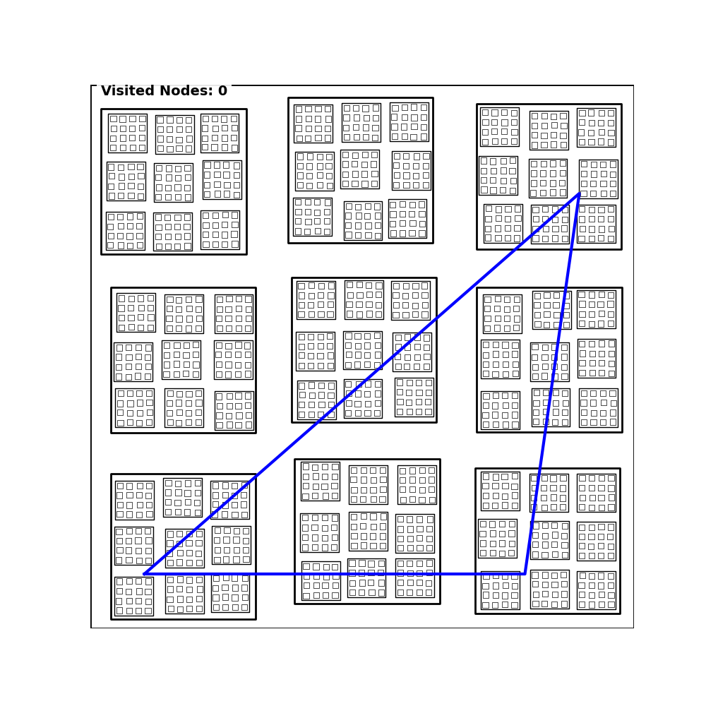

[🇰🇷 한국어 (Korean)](README_ko.md)

# 📐 AR Spatial Filtering: View Frustum Optimization for R-tree


> **"Why search a Rectangle when you are looking through a Triangle?"**
>
> **"삼각형으로 세상을 보는데, 왜 사각형으로 검색하나요?"**

---

## 🇺🇸 English Version

### 1. Introduction & Research Paper
This project is a Python implementation and visualization of the optimization algorithm proposed in the 2011 research paper. It addresses the inefficiency of using **Minimum Bounding Rectangles (MBR)** for **Augmented Reality (AR)** spatial queries.

* **Paper Title**: [Spatial Filtering Techniques for Geospatial AR Applications in R-tree](https://scienceon.kisti.re.kr/srch/selectPORSrchArticle.do?cn=JAKO201117148820644)
    * *(Original Korean Title: R-tree에서 GeoSpatial AR 응용을 위한 공간 필터링 기법)*
* **The Problem (Dead Space)**: AR applications view the world through a **triangular field of view (frustum)**. However, traditional spatial databases filter queries using rectangular MBRs. Searching a triangular area with a rectangle inevitably includes unnecessary data outside the view but inside the rectangle. This wasted search area is called **Dead Space**, causing significant I/O overhead.
* **The Solution**: Instead of checking `MBR overlaps MBR`, this algorithm pushes the **Triangle Geometry Predicate** down into the R-tree traversal. It **prunes** entire branches of the tree that do not intersect the actual view frustum, even if their MBRs overlap.

### 2. Visual Proof: The Power of Pruning
We simulated a **Depth-4 R-tree** (City -> District -> Neighborhood -> Building) to benchmark the traversal path.

* **Black Lines**: Unvisited / Pruned nodes (Unknown territory).
* **Green Lines**: Visited / Scanned nodes (I/O cost incurred).

#### 0. Baseline Map (The Data)
This is the complete dataset indexed by a hierarchical R-tree.
<div align="center">
  
</div>

#### Comparison: Standard vs. AR Filter

| 1. Standard MBR Search (Traditional) | 2. AR Triangle Filter (Optimized) |
| :---: | :---: |
|  |  |
| **Why it's inefficient:**<br>The algorithm defines a search box (Blue Dashed Line) that covers the triangle. It blindly visits every parent node touching this box. Notice the **huge green rectangular area**. All the green nodes outside the triangle are **Dead Space**—wasted processing. | **Why it's optimized:**<br>The algorithm checks if a parent node intersects the **Blue Triangle** itself. If a parent node (e.g., a District) is inside the MBR but outside the Triangle, it is **PRUNED** immediately. Notice how the "green spread" is strictly confined to the triangle wedge. The rest remains **Black**, meaning those nodes were never even touched. |

### 3. How to Run

```bash
# Clone and Install
git clone [https://github.com/YOUR_USERNAME/ar-spatial-filtering.git](https://github.com/YOUR_USERNAME/ar-spatial-filtering.git)
cd ar-spatial-filtering
pip install -r requirements.txt

# Run Visualization
python src/fast_visualizer.py
```

*Keywords: Python, R-tree, GIS, Augmented Reality, Spatial Indexing, Visualization, Matplotlib, PostGIS*